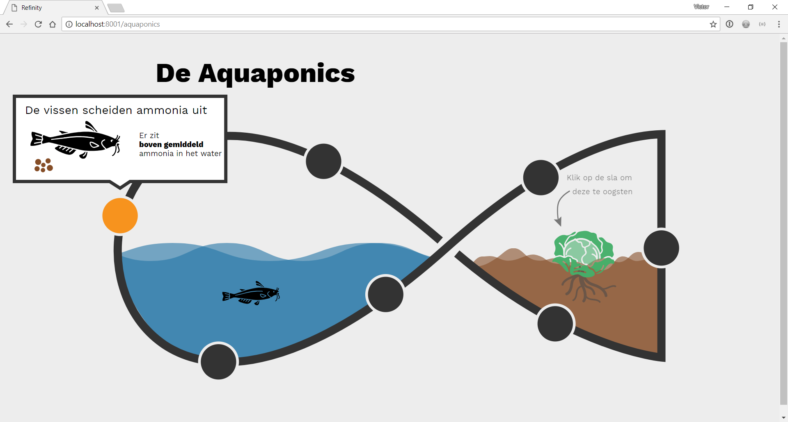
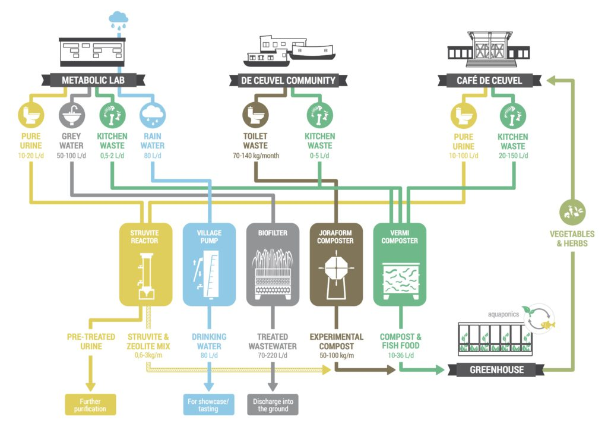
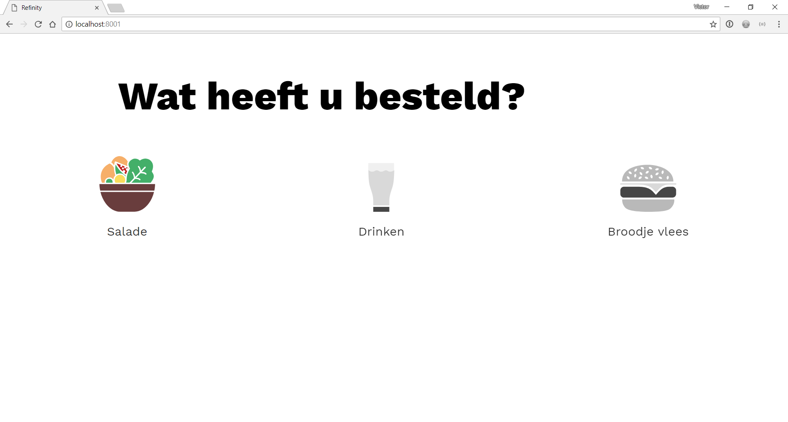
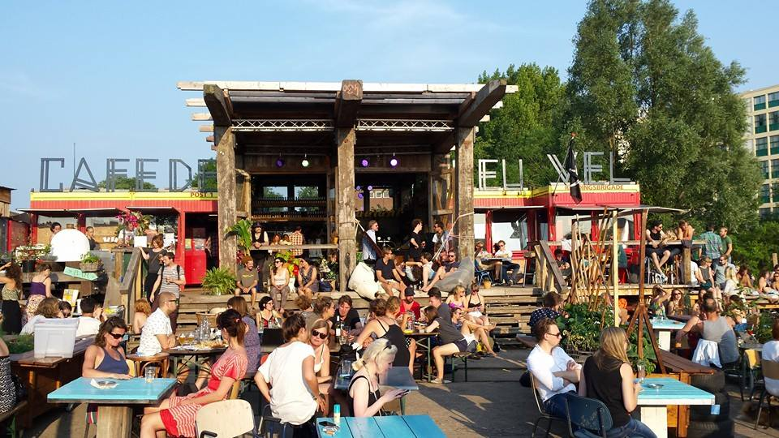

# Refinity

This repo holds the project we did for café [de Ceuvel](http://deceuvel.nl/nl/about/sustainable-technology/) in Amsterdam. The project is about the [aquaponics](https://nl.wikipedia.org/wiki/Aquaponics) they use for their plants. I made a visualisation of all the data that café de Ceuvel store online.


> Try the
> [**prototype**](https://refinity.herokuapp.com/).

## Table of contents

- [Background](#background)
- [User Scenario](#user-scenario)
- [Principles](#principles)
- [Awesome code!](#awesome-code-)
- [Data](#data)
- [Set up](#set-up)
- [How do I see the future](#how-do-i-see-the-future)
- [License](#license)

## Background

For a week I have been busy with making a website for café de Ceuvel in Amsterdam. 

"De Ceuvel is an award-winning, sustainable planned workplace for creative and social enterprises on a former shipyard adjacent to the Johan van Hasselt kanaal off the river IJ in Amsterdam North. In 2012, the land was secured for a 10-year lease from the Municipality of Amsterdam after a group of architects won a tender to turn the site into a regenerative urban oasis."

They use a few systems for making sustainable things


> All systems of de Ceuvel

This assignment I only focused on the aquaponics. This is a sustainable way to make plants where the nutrition for the plants are coming form catfish. You can see the whole system visualized. I call it the waiting therapy. When you have to wait for your food or drinks you can see where it comes from.

I based the main design on the infinity logo `∞`. It is a recycle round but you can see two systems. The system of the fish and of the plants. When you open the information you can see some live data that I used from the excel sheet. 

I made sure all data is loaded server-side, because on the client there where already a lot of really heavy tasks (like the animations). The downside to this, is that the data is only updated on reload.


> Homescreen of the website

## User Scenario

The user I made the website for is someone who comes for lunch/diner or a drink at de Ceuvel. The user is someone with a phone. After the user orders something he/she can go to the website. As a waiting therapy the user can see which system of de Ceuvel his/her order comes from. While waiting on the food the user has something to do. 

At the end of the animation the user can see all details of the system he/she choose. The user can see exactly where all food/drinks come from. 

When the user is done the order should be there for him/her to drink and enjoy a nice sit at café de Ceuvel.


> Photo of users at café de Ceuvel

## Principles

There are a lot of [principles](http://bokardo.com/principles-of-user-interface-design/) I looked into and tried to take the adventage of. Below is a list of the principles with a little description of how I implemented the principle.

02. **Interfaces exist to enable interaction**

The animations show where everything comes from. It should give the user a good idea of what he/she can do.

04. **Keep users in control**

The user can show and do everything he/she wants. Like placing the fish, choosing the info and showing when or what is happening. This way the user has the idea he/she can really choose what to do.

11. **Strong visual hierarchies work best**

The website uses great hierarchies. The main thing pops out every time. Secondary things should be really read as second. The user knows where to look at and where to find the things he/she wants to find.

14. **Progressive disclosure**

The user sees only the necessary things. The things that show later will literaly slide in later. Only slide in when the user wants that. This gives a clean look and makes sure the user gets not all confused of all info thats thrown to him/her.

15. **Help people inline**

16. **A crucial moment: the zero state**

These two are things that move together. I made sure the user gets a message to know what to do next. The user should not get confused that way. When the user has already done the thing that I indicated the message will hide. That way the user sees only necessary information.


## Awesome code!

On the javascript side I used object based javascript. This way I had a good overview. 
```javascript
const app {
  init: function () {
    //do things
  }
  //methods
}

app.init()
```

To make this website I used [Greensock](https://greensock.com/) for all animations. This made it easy to made the powerfull animations.
The animations are all svg based. The main animation is a whole `svg` inside html. That made it easy to animate, but difficult to change. Next to greensock I used svg animations built in SVG. This animation I started with javascript client-side.

```javascript
svg.followPath.beginElement()
``` 

I edited the svg in `Adobe Illustrator` after that I took the raw code and added it inside the `html`

For templating I used `nunjucks`. This made it easy to implement data and have a nice overview of all components. I only used two views.
```javascript
app.get('/', (req, res) => {
  res.render('index.html', {})
})

app.get('/aquaponics', (req, res) => {
  res.render('aquaponics.html', {})
})
```

For a useful phone experience I made sure the user could see the animation the right way. I added an svg and css to show the user that it should rotate their phone.
```html
<div class="landscape-only">
    
    Please rotate your phone
</div>
```

It shows this message when the viewport is too small and the user is in `portrait`. It checks it in the CSS.
```SCSS
@media screen and (orientation: portrait) and (max-width: 37.5rem) {
  .landscape-only {
    display: flex; 
  } 
}
```

## Data

The data I use comes from the api of de Ceuvel and data that is updated by the feeder/harvester himself.

To connect to the api I used this code:
```javascript
const api = {
  url: new sockJs('url'),
  client: null,
  init: function() {
    this.client = Stomp.over(this.url)
    this.client.connect('web', 'user', this.onConnect)
  },
  onConnect: function() {
    api.client.subscribe('exact-url', api.handleData)
  },
  handleData: function(d) {
    console.log(JSON.parse(d.body))
  }
}

api.init()
```

I collect this data server-side and put it in `html` templates with nunjucks.

Next to this data there is a great collection of data in excel sheets. I used that to make a more data-rich website.

## Set up
**1. Clone repository:**
```
git clone https://github.com/velomovies/project3-new-concepts-with-realtime-data.git
```
**2. Install dependencies:**
```json
{ "devDependencies": {
    "babel-core": "^6.26.0",
    "babel-preset-env": "^1.6.1",
    "gulp": "^3.9.1",
    "gulp-babel": "^7.0.1",
    "gulp-clean": "^0.4.0",
    "gulp-concat": "^2.6.1",
    "gulp-connect": "^5.5.0",
    "gulp-imagemin": "^4.1.0",
    "gulp-open": "^3.0.1",
    "gulp-sass": "^4.0.0",
    "gulp-sequence": "^1.0.0",
    "gulp-uglify": "^3.0.0",
    "compression": "^1.7.2",
    "express": "^4.16.3",
    "nunjucks": "^3.1.2",
    "gulp-nodemon": "^2.2.1",
    "dotenv": "^5.0.1"
  },
  "dependencies": {
    "sockjs-client-node": "^1.0.0",
    "stompjs": "^2.3.3"
  }
}  
```

To install all you have to do:
```
npm install
```

**3. Build and start server:**
```
gulp start
```
To run the server without opening a new tab you simply have to do:
```
gulp
```

## How do I see the future

Oh well... The bright future. 
For this project I made sure I had cool animations. The downside to focussing on that is that the performance is not amazing. Animations makes it always more difficult, but if I had more time I could make the performance better.

The data I used was online and live, but it did not change client-side. With improving the performance I can easily make a way to update the data live.

Next to the performance and data I could make the whole website more accesible. With animations it is always difficult, but I could do some tricks to make it more accesible. Like `aria-labels` and telling what happens on the screen.

## License

GPL-3.0 © Victor Zumpolle